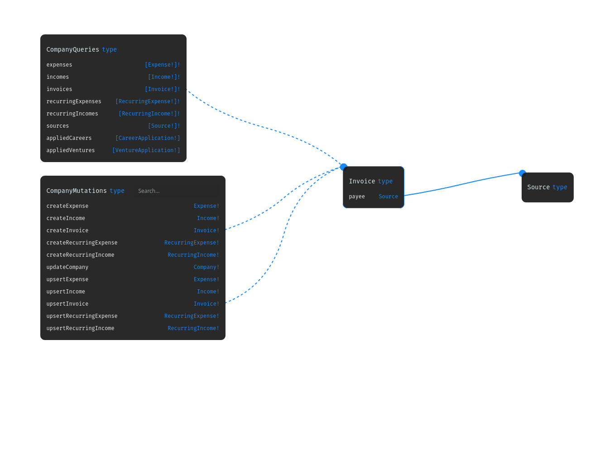

# ERD like Relation View

Browsing a big GraphQL Schema with code only is nearly impossible. Instead, you should use our diagram view to browse it.

<figure><figcaption>
Example ERD relation View
</figcaption></figure>

### Navigation

To navigate through this view. Click nodes and they will be centered with displayed relations.

### Search & Order

Searching and ordering is available inside the top bar

<figure><figcaption></figcaption></figure>

After searching you will get only the nodes from the search. Ordering is used to switch the order of Type Definitions like `type` `scalar` `interface` `enum` `input` `union`

### Node options

More options are available after selecting a node

<figure><figcaption></figcaption></figure>

#### Parent

Display parent relations. So basically display where this node is used. Turn off to only display children's relations.

#### Scalars

Display/hide base scalar fields including `String, Int, Float, ID, Boolean`

#### Enums

Expand/hide all enums. Enums can be tricky, the localization enum can consist of hundreds of values.

#### Deselect node

Deselect active node

#### Focus node&#x20;

Scrolls the node to the center of the current view.

#### Export to PNG

Export current relation nodes to png file.
