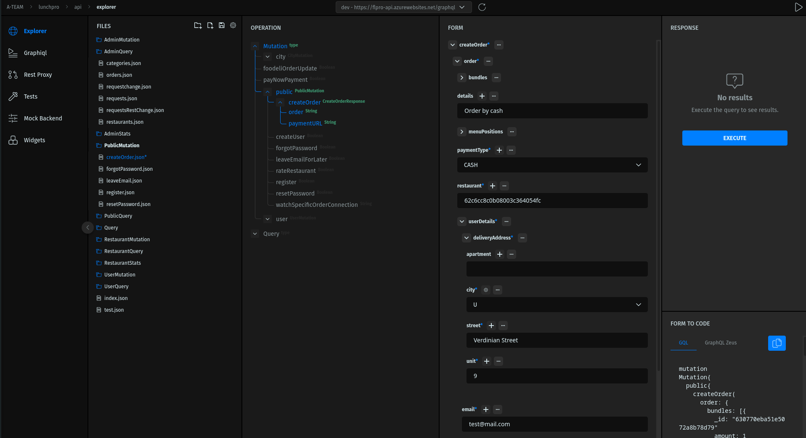

# Resolvers

To do so please navigate to the resolvers screen in the microservices section. Then please provide paths of your resolvers to each GraphQL field you want to be resolved.


If you use any build system, please provide paths to built files. For example, you can have a file `src/Query/people.ts` but it will output to `lib/Query/people.js` so you should provide `lib/Query/people.js`


