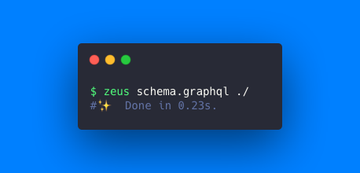
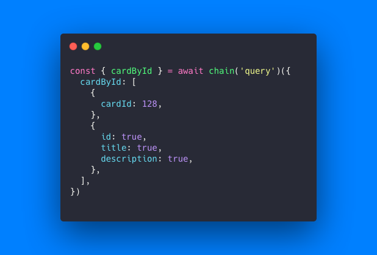

# GraphQL Zeus

Strongly Typed GraphQL from the [GraphQL Editor](https://graphqleditor.com/?utm\_source=graphql\_zeus\_github) team.

GraphQL Zeus is simply the best way to interact with your GraphQL endpoints in a type-safe way. Zeus uses your schema to generate Typescript types and strongly typed clients to unlock the power, efficiency, productivity and safety of Typescript on your GraphQL requests.

## Features:

⚡️ Types mapped from your schema\
⚡️ Works with Apollo Client, React Query, Stucco Subscriptions _(\*more coming soon...)_\
⚡️ Works with Subscriptions\
⚡️ Infer complex response types\
⚡️ Create reusable selection sets (like fragments) for use across multiple queries\
⚡️ Supports GraphQL Unions, Interfaces, Aliases and Variables\
⚡️ Handles even absolutely **massive** schemas\
⚡️ Supports Browsers, Node.js and React Native in Javascript and Typescript\
⚡️ Schema downloader\
⚡️ JSON schema generation\

## Generate Types With Zeus CLI

Simply run Zeus in your terminal to output your types file based on your graphql schema:

<figure><figcaption></figcaption></figure>

## Usage Example

A simple example of using a generated `chain` client. Queries, mutations and subscriptions are now type-safe in arguments, field selections and response types:

<figure><figcaption></figcaption></figure>
